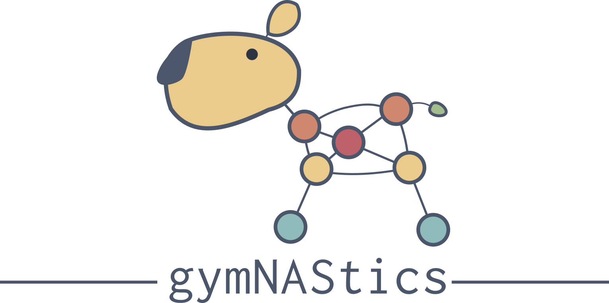

<p align="center">
  <!-- license -->
  <a href="https://tldrlegal.com/license/apache-license-2.0-%28apache-2.0%29">
      
  </a>
  <!-- CI status -->
  <a href="">
    
  </a>
  <!-- Code analysis -->
  
  <!-- Getting started colab -->
  <a href="">
      
  </a>
</p>

<p align="center">
  <i>A "gym" style toolkit for building lightweight NAS systems. I know, the name is awful. </i>
</p>

## Overview

Over the course of the final year of my PhD I worked a lot on Neural Architecture Search (NAS) and built a bunch of tooling to make my life easier. This is an effort to standardise the various features into a single framework and provide a "gym" style toolkit for comparing various algorithms.

The key use cases for this library are:
- test out new predictors on various NAS benchmarks 
- visualise the cells/graphs of your architectures
- add new operations to NAS spaces 
- add new backbones to NAS spaces

The framework revolves around three key classes:
1. `Model`: 
2. `Proxy`: 
3. `SearchSpace`: 


### Obligatory builder pattern README example

The goal of the library will be to be able to do stuff like:

```python
import gymnastics 
from gymnastics.datasets import CIFAR10
from gynastics.proxies import NASWOT
from gymnastics.searchspace import SearchSpace, NASBench101Skeleton, NASBench201CellSpace

# use the 101 Skeleton with the 201 cell space
skeleton = NASBench101Skeleton()
cell_space = NASBench201CellSpace()

search_space = SearchSpace(
  skeleton, cell_space
)

# create an accuracy predictor
proxy = NASWOT()
train, _ = CIFAR10()

minibatch = train.sample_minibatch()

best_score = 0.
best_model = None

# try out 10 random architectures and save the best one 
for i in range(10):

  model = search_space.sample_random_architecture()

  score = proxy.score(model, minibatch)

  if score > best_score:
    best_score = score
    best_model = model

best_model.show_picture()
```

Which prints:


## Supported operations

| Done | Tested | Op                  | Paper                                         | Notes                                                               |
| ---- | ------ | ------------------- | --------------------------------------------- | ------------------------------------------------------------------- |
| [x]  |        | conv                | -                                             | params: kernel size                                                 |
| [x]  |        | gconv               | AlexNet                                       | + params: group                                                     |
| [x]  |        | depthwise separable | [pdf](https://arxiv.org/pdf/1610.02357v3.pdf) |                                                                     |
| [x]  |        | mixconv             | [pdf](https://arxiv.org/pdf/1907.09595.pdf)   |                                                                     |
| [x]  |        | octaveconv          | [pdf](https://arxiv.org/pdf/1904.05049.pdf)   | Don't have a sensible way to include this as a single operation yet |
| [ ]  |        | shift               | [pdf](https://arxiv.org/pdf/1711.08141.pdf)   |                                                                     |
| [ ]  |        | ViT                 |                                               |                                                                     |
| [ ]  |        | Fused-MBConv        | [pdf](https://arxiv.org/pdf/2104.00298.pdf)   |                                                                     |
| [x]  |        | Lambda              | [pdf](https://arxiv.org/pdf/2102.08602.pdf)   |                                                                     |
| [ ]  |        |                     |                                               |                                                                     |
